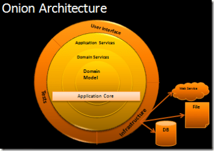

# Onion Architeture - POC

### Sobre a arquitetura Onion
Criada por Jeffrey Palermo, assim como a arquitetura hexagonal ela também tem por objetivo a separação entre responsabilidades (SoC) das partes do sistema, propiciando uma maior manutenibilidade. Segundo o autor, ela não é apropriada para pequenos sistemas como pequenos web sites, mas sim voltada para aplicações corporativas de longa duração e que possuem uma complexa lógica de negócios. Ela enfatiza o uso de interfaces para descrever contratos de comportamentos e força a externalização da infraestrutura (tecnologia). 
A arquitetura se baseia principalmente no controle de acoplamento, na qual camadas mais externas podem depender de camadas mais internas, ou seja, todo o acoplamento é voltado para o centro. Para alcançar isso, a arquitetura faz vasto uso do principio de inversão de dependência, na qual as camadas mais internas dependem de contratos (interfaces) para outros serviços, cujas implementações são externalizadas nas camadas seguintes.

#     

### Princípios fundamentais da Arquitetura Onion
O autor sem seu blog ainda estabelece os princícios fundametais de sua arquitetura. São eles:
1. O sistema é contruído ao redor de uma camada de modelo, que é independente.
2. Camadas internas definem interfaces. Camadas externas implementam interfaces.
3. A direção do acoplamento é sempre para o centro.
4. Todo o código do core da aplicação (camadas domain model, domain services e application services) deve poder ser compilado e executado sem a camada de infraestrutura 

### Sobre esta POC
A POC foi desenvolvida em Java e consiste em um projeto *gradle* multi-módulos, sendo eles:
#### domain-model
+ Módulo que define as classes de domínio (pojo + regras de negócio individuais) e contratos para serviços de domínio (interfaces). Corresponde ao núcleo da aplicação.

#### domain-services
+ Módulo responsável por definir os contratos (interfaces) para os casos de uso da aplicação e demais serviços de persistências de dados. Além de interfaces, neste módulo podem constar também implementações, no caso de orquestrações entre duas ou mais classes do modelo (domain-model).

#### application-services
+ Neste módulo ficam as implementações dos casos de usos (contratos definidos em domain-services) e das classes repositories de negócio. Cabe ressaltar que ainda nesta camada toda e qualquer implementação é agnóstica de tecnologia ou *framework*. No caso das implementações que dependem de serviços externos (ex: persistências de dados), esta depedência é por meio de interfaces.

#### external-services
+ Somente nesta camada devem estar as implementações que possuem depedências diretas a *frameworks* e tecnologias. Nesta camada residem as classes que implementam os serviços de APIs REST, persistência de dados podendo fazer uso de mapeamento objeto-relacional (entities e repositories JPA) e dependências a *frameworks* como o *Spring*. Além disso, é nesta camada onde devem estar os testes unitários e de integração.    

### Passos para compilar e testar o projeto
1. Certifique-se que esteja no diretório `onion-poc`
2. Execute o comando a seguir para baixar as dependências do projeto, executar seus testes automatizados e compilar o mesmo:   `./gradlew build`. Será gerado o jar da aplicação no diretório `./external-services/build/libs`
3. Ainda na raíz do projeto, execute o comando abaixo para iniciar a execução da aplicação na porta 8080
`gradle external-services:bootRun`
4. Na raíz do projeto disponibilizei o arquivo `OnionArch.postman_collection.json`, ele contem uma *collection* do Postman. Importe esta *collection* no Postman para testar os endpoints do serviço REST.
